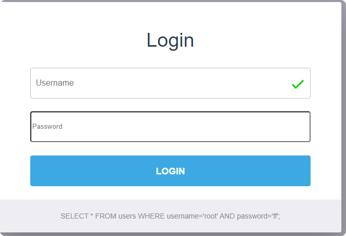
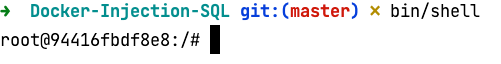

`  ____   ___  _       ___        _           _   _             
/ ___| / _ \| |     |_ _|_ __  (_) ___  ___| |_(_) ___  _ __  
\___ \| | | | |      | || '_ \ | |/ _ \/ __| __| |/ _ \| '_ \
___) | |_| | |___   | || | | || |  __/ (__| |_| | (_) | | | |
|____/ \__\_\_____| |___|_| |_|/ |\___|\___|\__|_|\___/|_| |_|
|__/
`


Container Docker pour suivre le cours sur les Injections SQL

# Prérequis

* Docker
* Docker-compose
* Ports 8000, 8032, 8081 disponibles

# Lancement

Cloner le dépôt sur votre WSL

```bash
git clone git@github.com:LiliwoL/B3-Docker-Injection-SQL-Demonstration.git
```

Lancer le container

```bash
cd B3-Docker-Injection-SQL-Demonstration
bin/start
```

Accéder à la page web à l'adresse suivante:

http://127.0.0.8:8000


---

Accédez au shell du container MySQL

```bash
bin/shell
```



Lancement du client mysql (saisissez le mot de passe **root**)

```bash
root@94416fbdf8e8:/# mysql -u root -p
Enter password: 
Welcome to the MariaDB monitor.  Commands end with ; or \g.
Your MariaDB connection id is 7
Server version: 10.7.3-MariaDB-1:10.7.3+maria~focal mariadb.org binary distribution

Copyright (c) 2000, 2018, Oracle, MariaDB Corporation Ab and others.

Type 'help;' or '\h' for help. Type '\c' to clear the current input statement.

MariaDB [(none)]> 
```

